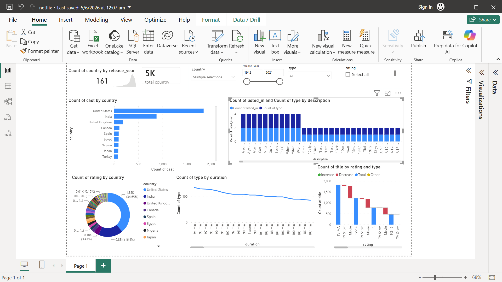

# Netflix-Content-Analytics-Dashboard

# 🎬 Netflix Content Analytics Dashboard | Power BI

## 📌 Project Overview

The Netflix Content Analytics Dashboard is an interactive Power BI project designed to analyze Netflix's global content library. The dashboard provides insights into content distribution, ratings, countries, release trends, content types, and duration patterns.

This project transforms raw Netflix data into meaningful visual insights to help understand content availability and viewing trends across different regions.

---

## 🖼️ Dashboard Preview

---

## 🎯 Business Objective

The objective of this dashboard is to analyze Netflix content and answer key business questions:

- Which countries contribute the most content?
- What are the most common content ratings?
- How has Netflix content evolved over time?
- What is the distribution between Movies and TV Shows?
- Which durations are most common?
- How is content distributed across regions?

---

# 📊 Key Performance Indicators (KPIs)

| KPI | Description |
|------|-------------|
| Total Titles | Total Netflix titles available |
| Total Countries | Countries represented in dataset |
| Total Movies | Number of Movies |
| Total TV Shows | Number of TV Shows |
| Average Release Year | Average content release year |
| Most Common Rating | Most frequent content rating |

---

# 📈 Dashboard Visualizations

## 1️⃣ Total Countries Analysis

**Visual:** KPI Card

### Purpose
Displays the total number of countries represented in the Netflix catalog.

### Business Insight
- Measures Netflix's global reach.
- Shows international content diversity.

---

## 2️⃣ Total Content Analysis

**Visual:** KPI Card

### Purpose
Displays the total number of Netflix titles.

### Business Insight
- Measures overall content volume.
- Tracks content growth opportunities.

---

## 3️⃣ Cast Count by Country

**Visual:** Horizontal Bar Chart

### Purpose
Shows the number of cast appearances across countries.

### Business Insight
- Identifies countries contributing the largest talent pool.
- Highlights regional content dominance.

---

## 4️⃣ Content Categories by Description

**Visual:** Stacked Column Chart

### Purpose
Analyzes content classifications and category distribution.

### Business Insight
- Identifies popular content genres.
- Helps understand audience preferences.

---

## 5️⃣ Rating Distribution by Country

**Visual:** Donut Chart

### Purpose
Displays how Netflix ratings are distributed globally.

### Business Insight
- Reveals content maturity levels.
- Helps understand audience targeting strategies.

---

## 6️⃣ Content Duration Analysis

**Visual:** Line Chart

### Purpose
Shows distribution of content duration.

### Business Insight
- Identifies preferred movie lengths.
- Helps understand content consumption patterns.

---

## 7️⃣ Rating vs Content Type

**Visual:** Waterfall Chart

### Purpose
Compares ratings across Movies and TV Shows.

### Business Insight
- Evaluates content classification trends.
- Supports content strategy decisions.

---

# 🎛️ Interactive Filters

The dashboard includes:

- Country Filter
- Release Year Filter
- Content Type Filter
- Rating Filter

These slicers allow users to dynamically explore Netflix content.

---

# 📂 Dataset Information

The dataset contains:

- Show ID
- Title
- Director
- Cast
- Country
- Release Year
- Date Added
- Rating
- Duration
- Type (Movie / TV Show)
- Genre
- Description

---

# 🛠️ Tools & Technologies

### Visualization
- Power BI Desktop

### Data Transformation
- Power Query

### Analytics
- DAX Measures
- Calculated Columns
- Interactive Dashboards

---

# 🔑 Key Insights

✅ United States contributes the highest number of titles.

✅ Movies significantly outnumber TV Shows.

✅ TV-MA is the most common content rating.

✅ Netflix content has expanded rapidly in recent years.

✅ Content production is concentrated among a few major countries.

✅ Duration patterns indicate strong preference for standard movie lengths.

---

# 🚀 Business Impact

This dashboard can help:

- Content Analysts
- Media Researchers
- Streaming Platform Analysts
- Data Analysts
- Entertainment Industry Professionals

understand content trends and make data-driven decisions.

---

